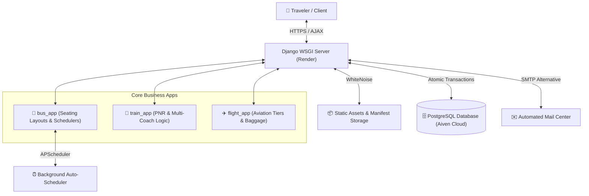

# 🌐 TravelGo — Universal Multi-Modal Travel Booking Platform

<div align="center">


**An enterprise-grade, full-stack travel reservation web application built with Django & PostgreSQL.**  
*Seamlessly search, compare, and book Buses, Trains, and Flights from a unified interface with real-time seat matrix layouts and atomic race-condition protection.*

</div>

---

## 📖 Executive Summary

**TravelGo** is a comprehensive, production-ready travel reservation system designed to unify bus, train, and airline bookings into a modern SaaS platform. Engineered with scalable Django architecture and enterprise software design patterns, it bridges intuitive customer workflows with a powerful administrative back-office portal. 

Featuring custom visual seat selection layouts, real-time AJAX search filtering without page reloading, interactive digital E-ticket confirmations, and background automated route generation via **APScheduler**, TravelGo delivers a premium online booking experience.

---

## ✨ Key Features & Highlights

### 🚌 Interactive Bus Reservations (`bus_app`)
- **Visual Seat Deck Simulation:** Interactive interactive seating layouts supporting both **Seater (2x3 matrix)** and **Sleeper (Upper & Lower berths)** coach topologies.
- **Dynamic Route Filtering:** Filter routes in real-time by price tier (`0-500`, `500-1000`, `1000+`), rating, bus amenities (AC/Non-AC), and seating type via asynchronous AJAX partial rendering.
- **Automated Fleet Scheduling:** Integrated background scheduler (`APScheduler`) that automatically populates weekly schedules and prunes historical inactive routes.

### 🚆 Train Reservation System (`train_app`)
- **Multi-Coach Allocations:** Support for diverse travel classes including **First Class AC (1AC)**, **Second Class AC (2AC)**, **Third Class AC (3AC)**, **Sleeper (SL)**, and **Second Sitting (2S)**.
- **PNR Generation & Digital Tickets:** Automatically generates tamper-proof unique 10-character PNR booking numbers and formats digital, print-ready passenger E-tickets.
- **Atomic Seat Synchronization:** Uses robust transaction locking to maintain accurate seat counts across concurrent customer bookings.

### ✈️ Flight Booking Suite (`flight_app`)
- **Aviation Class Tiering:** Multi-tier inventory management covering **Economy**, **Premium Economy**, **Business**, and **First Class** accommodations.
- **Baggage Allowance Tracking:** Transparent integration of Check-In baggage rates and Cabin carry-on weight limits directly into booking workflows.
- **Dynamic Pricing Engine:** Automatic seat pricing calculation tied to specific airline class availability and travel timelines.

### 🧭 Universal Smart Search & UX (`travel`)
- **Unified Query Portal:** Single omni-search interface allowing customers to query across any transit mode with rapid date toggles (*Today*, *Tomorrow*, or *Custom Calendar*).
- **Session Search Memory:** Automatically logs and retains the user's most recent search parameters in secure browser sessions for 1-click route re-checks.
- **HTML Email Notifications:** Fully styled SMTP notification system delivering instant automated support confirmations to both users and platform staff upon ticket inquiries.

### 👤 Personal Customer Portal (`user_dashboard`)
- **Travel Analytics:** Overview metrics aggregating user itineraries, booking statuses, and transport-type ratios.
- **Profile Lifecycle Management:** Custom user profiles with automated creation signals (`post_save`), custom Avatar picture uploading, phone formatting, and zero password encryption risks during updates.
- **Instant Cancellation Handler:** Real-time ticket cancellation functionality that atomically restores seat availability directly back to active inventory tables.

### 🏢 Operations Admin Command Center (`admin`)
- **Dedicated Management UI:** Custom administrative back-office bypassing generic admin interfaces for tailored operational efficiency.
- **Route & Fleet CRUD:** Complete lifecycle management for Cities, Bus Vehicles, Train Schedules, Airline Inventories, and Platform Staff.
- **1-Click Operational Toggles:** Activate or suspend transit lines instantly without destroying underlying analytics or historical customer receipts.

---

## 🏛️ System Architecture & Engineering Excellence

TravelGo goes beyond standard CRUD applications by implementing enterprise software engineering best practices:



### 🔒 Race Condition Prevention (Atomic Transactions)
In high-concurrency booking environments, multiple users often attempt to reserve the final remaining seat simultaneously. TravelGo utilizes **Django Atomic Database Transactions** combined with explicit row-level locking (`select_for_update()` & `F() expressions`) to ensure seat inventories are safely decremented without double-booking occurrences or race-condition failures during booking cancellations.

---

## 🛠️ Technology Stack

| Domain | Technology / Tool | Usage Description |
| :--- | :--- | :--- |
| **Backend Framework** | **Django 5.2** | Core WSGI application framework, routing, business logic, and ORM. |
| **Programming Language**| **Python 3.11+** | Primary codebase syntax, backend utility scripts, and background services. |
| **Production Database** | **PostgreSQL (Aiven Cloud)** | High-reliability relational SQL database connected over verified SSL certs. |
| **Development DB** | **SQLite3** | lightweight, file-based SQL storage used for localized rapid development. |
| **Frontend Styling** | **Bootstrap / Vanilla CSS / Icons** | Responsive layout animations, glassmorphic interactive cards, and modal systems. |
| **Dynamic UX** | **JavaScript (ES6) / Fetch & AJAX** | Live search filtering, dynamic seating generation, and responsive toast alerts. |
| **Static Asset Engine**| **Whitenoise** | Manifest compressed storage for serving production static CSS/JS on cloud dynos. |
| **Task Automation** | **APScheduler & Django-Crontab** | Scheduled cron triggers for dynamic route regeneration and outdated log pruning. |
| **Deployment Cloud** | **Render Platform** | Fully automated WSGI hosting utilizing isolated build containers and `.env` configs. |

---

## 📁 Project Workspace & Architecture

```text
django-Travel/
│
├── Travel_project/          # ⚙️ Core Django configuration, middleware, and WSGI application
│   ├── settings.py          # Dual-environment configurations (SQLite Local / Postgres Render)
│   ├── urls.py              # Root router mapping modular app URLs
│   └── wsgi.py              # Production WSGI server binding
│
├── travel/                  # 🌐 Universal portal, homepage, Auth views, & Signal lifecycles
├── bus_app/                 # 🚌 Bus booking logic, seat grid matrix generation, & APScheduler
├── train_app/               # 🚆 Train multi-class ticketing, PNR generation, and atomic management
├── flight_app/              # ✈️ Aviation routes, class tiers, dynamic fare engines, and ticketing
├── user_dashboard/          # 👤 Customer analytics portal, profile adjustments, & trip history
├── admin/                   # 🏢 Customized enterprise operations & staff management dashboard
│
├── templates/               # 🎨 HTML design system, modals, component partials, and mail formats
├── static/                  # 🖼️ Compiled CSS styles, frontend interactive JS scripts, and logos
├── media/                   # 📂 Dynamic file storage for city icons, aviation logos, and avatars
│
├── db_cert/                 # 🔐 SSL root certificates for encrypted cloud database connections
├── final_fix.json           # 📦 Comprehensive seed fixture containing default production records
├── manage.py                # 🐍 Django command-line administrative executable
├── Procfile                 # ☁️ Cloud scaling deployment configurations for web servers
├── requirements.txt         # 📑 Python package dependencies and pinned architecture versions
└── README.md                # 📖 Official system documentation
```

---

## 🚀 Getting Started (Local Development Setup)

Follow this step-by-step guide to launch a fully functioning local development instance of TravelGo on your workstation.

### 1️⃣ Prerequisites
- **Python:** 3.10 or higher ([Download Python](https://www.python.org/downloads/))
- **Git:** Version control command line ([Download Git](https://git-scm.com/))

### 2️⃣ Clone Repository & Create Virtual Environment
Open your terminal and clone the project to your local workspace:
```bash
git clone https://github.com/yourusername/django-Travel.git
cd django-Travel

# Create a clean Python Virtual Environment
python -m venv env

# Activate Virtual Environment (Windows)
.\env\Scripts\activate

# Activate Virtual Environment (macOS/Linux)
source env/bin/activate
```

### 3️⃣ Install Dependencies
Install all required package distributions and database drivers:
```bash
pip install -r requirements.txt
```

### 4️⃣ Configure Environment Variables (`.env`)
Create a `.env` file in the root directory to safely handle development variables:
```ini
# Core Configuration
DEBUG=True
SECRET_KEY=your-local-development-secret-key-goes-here
RENDER=False

# Optional: Email SMTP parameters for inquiry feedback
EMAIL_HOST_USER=your-email@gmail.com
EMAIL_HOST_PASSWORD=your-google-app-password
```
*(Note: With `RENDER=False`, the application gracefully defaults to your local SQLite3 database).*

### 5️⃣ Execute Database Migrations & Load Fixtures
Apply the SQL schema architecture and import the provided seed database data:
```bash
# Apply Django migrations
python manage.py migrate

# Load initial Cities, Routes, Vehicles, and sample inventory data
python manage.py loaddata final_fix.json

# (Optional) Create a local superuser account for dashboard access
python manage.py createsuperuser
```

### 6️⃣ Start the Development Server
Launch the application locally:
```bash
python manage.py runserver
```
Visit **`http://127.0.0.1:8000`** in your browser to explore TravelGo! 🎈  
Access the Operational Staff Portal by navigating to **`http://127.0.0.1:8000/dashboard/`** or logging in with an administrator account.

---

## ☁️ Deployment Guide (Render & Cloud Hosting)

TravelGo is pre-configured for frictionless zero-downtime deployment on cloud platforms like **Render**, **Heroku**, or **AWS**:

1. **Static Files & Whitenoise:**  
   In production, Django is configured to automatically serve compressed CSS/JS assets via Whitenoise manifest storage. No separate static server setup is necessary. Ensure `python manage.py collectstatic --no-input` is specified during cloud builds.
2. **Cloud PostgreSQL Database Integration:**  
   When the `RENDER` environmental variable is present in production, the app dynamically routes database traffic to **PostgreSQL via Aiven Cloud** utilizing secure SSL validation certificates included in `/db_cert/`.
3. **Web Process Declaration:**  
   The root directory features a production `Procfile` ready for WSGI application running via standard WSGI workers (such as Gunicorn or uWSGI).

---

## 🧪 Testing & Code Quality Audit

TravelGo is engineered to strictly pass standard Django system verification checks and maintain database structural consistency without silent failures:
```bash
# Execute structural validation checks across all 7 modules
python manage.py check

# Verify DB schema consistency without generating mock files
python manage.py makemigrations --check --dry-run
```

---

## 🤝 Contributing & Licensing

Contributions, bug reports, feature optimizations, and architecture enhancements are warmly welcomed! Feel free to fork the repository, make improvements, and submit a pull request.

This project is open-source and released under the standard **MIT License**.

---
<div align="center">
  <b>Built with passion for modern travel experiences and robust engineering architecture.</b>
</div>
